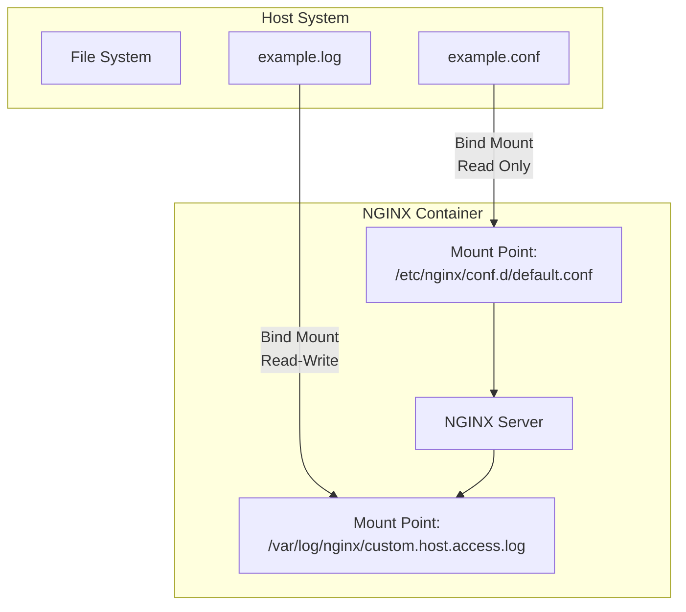

# 🐳 Docker Storage Management: Understanding Bind Mounts

[](https://github.com/TheToriqul/docker-bind-mounts)
[](https://www.docker.com/)
[](https://nginx.org/)

## 📋 Overview

This project demonstrates the implementation of Docker bind mounts for effective file system management between host and containers. It showcases real-world scenarios using NGINX configuration management and logging, highlighting how bind mounts enable seamless data sharing while maintaining security through read-only access controls.

## 🏗 Technical Architecture



## 💻 Technical Stack

- 🐳 Docker Engine
- 🌐 NGINX Web Server
- 🐧 Linux File System
- 📝 Shell Scripting

## ⭐ Key Features

1. File System Integration
   - Host-container file mapping
   - Read-only configuration mounts
   - Dynamic log file management

2. NGINX Configuration
   - Custom server configuration
   - External configuration management
   - Port mapping and routing

3. Security Implementation
   - Read-only bind mounts
   - Isolated container environment
   - Controlled file access

4. Logging System
   - External log storage
   - Real-time log access
   - Host-based log management

## 📚 Learning Outcomes

### Technical Mastery:
1. Docker bind mount implementation
2. Container file system management
3. NGINX server configuration
4. Linux mount point concepts
5. Container security practices

### Professional Growth:
1. System architecture design
2. Documentation development
3. Security-first thinking
4. Problem-solving skills
5. Best practices implementation

## ⚙️ Installation

### Prerequisites
- Docker Engine 20.10+
- Linux-based operating system
- Basic understanding of NGINX

### Setup Steps
1. Clone the repository:
   ```bash
   git clone https://github.com/TheToriqul/docker-bind-mounts.git
   ```
2. Navigate to project directory:
   ```bash
   cd docker-bind-mounts
   ```
3. Create necessary host files:
   ```bash
   touch ~/example.log
   ```

## 📫 Contact

- 📧 Email: toriqul.int@gmail.com
- 📱 Phone: +65 8936 7705, +8801765 939006

## 👏 Acknowledgments

- [Poridhi for excellent labs](https://poridhi.io/)

---
Feel free to explore, modify, and build upon this configuration as part of my learning journey. You're also welcome to learn from it, and I wish you the best of luck!