# 🐳 Docker Storage Management: Understanding Bind Mounts

[](https://github.com/TheToriqul/docker-bind-mounts)
[](https://www.docker.com/)
[](https://nginx.org/)

## 📋 Overview

A comprehensive implementation demonstrating Linux file system concepts and Docker bind mount configurations using NGINX. Built for DevOps engineers and system administrators seeking to master container volume management and file system operations.

This project bridges the gap between theoretical file system knowledge and practical container deployment, offering hands-on experience with bind mounts in production environments.

Current Status: Production-Ready ✅

## 🏗 Technical Architecture

The system implements a sophisticated bind mount configuration leveraging Linux's unified tree structure for seamless container-host file sharing.

```mermaid
graph TB
    subgraph "🖥️ Host System" 
        direction TB
        A[fa:fa-tree File System Tree]
        B[fa:fa-folder Mount Points]
        C[fa:fa-file Configuration Files]
        D[fa:fa-file-alt Log Files]
    end
    
    subgraph "🐳 Docker Container"
        direction TB
        E[fa:fa-server NGINX Server]
        F[fa:fa-cog Server Config]
        G[fa:fa-chart-line Logs]
    end
    
    A -->|Manages| B
    B -->|Hosts| C
    B -->|Stores| D
    C -->|"Bind Mount (Read-Only)"| F
    D -->|"Bind Mount (Read-Write)"| G
    F -->|Configures| E
    E -->|Writes| G
```


## 💻 Technical Stack

- 🐳 Docker Engine
- 🌐 NGINX Web Server
- 🐧 Linux File System
- 📝 Shell Scripting


## ⭐ Key Features

1. File System Management   - Unified tree structure implementation
   - Mount point configuration
   - Access control management

2. Docker Integration
   - Bind mount setup
   - Volume management
   - Container networking

3. NGINX Configuration   - Custom server blocks
   - Log management
   - SSL/TLS setup

4. Security Implementation
   - Read-only configurations
   - Permission management
   - Access control

5. Performance Optimization   - Mount point optimization
   - Container resource management
   - Log rotation

6. Monitoring & Debugging
   - Mount point inspection
   - Log analysis
   - Performance metrics

## 📚 Learning Journey

### Technical Mastery:

1. Linux File System Architecture
2. Docker Storage Solutions
3. NGINX Configuration Management
4. Bind Mount Implementation
5. Security Protocols

### Professional Development:

1. System Architecture Design
2. Documentation Development
3. Problem-solving Methodology
4. Performance Optimization
5. Security Implementation

## 🔄 Future Enhancements<details><summary>View Planned Improvements</summary>

1. Automated Mount Point Management
2. Enhanced Security Protocols
3. Performance Monitoring Tools
4. Multi-Container Orchestration
5. Advanced Logging Solutions
6. Backup Strategy Implementation
</details>

## ⚙️ Installation

<details>
<summary>View Installation Details</summary>

### Prerequisites

- Docker Engine 20.10+
- Linux Operating System
- Root or sudo access
- Basic NGINX knowledge

### Setup Steps

1. Clone the repository:

```bash
git clone https://github.com/TheToriqul/docker-bind-mounts.git
cd docker-bind-mounts```

2. Set environment variables:

```bash
export CONF_SRC=~/example.conf
export CONF_DST=/etc/nginx/conf.d/default.conf
export LOG_SRC=~/example.log
export LOG_DST=/var/log/nginx/custom.host.access.log
```

3. Create configuration files:

```bash
touch ~/example.log
cat > ~/example.conf <<EOF
server {
    listen 80;
    server_name localhost;
    access_log /var/log/nginx/custom.host.access.log main;
    location / {
        root /usr/share/nginx/html;
        index index.html index.htm;
    }
}
EOF

```

</details>

## 📫 Contact

- 📧 Email: toriqul.int@gmail.com
- 📱 Phone: +65 8936 7705, +8801765 939006

## 🔗 Project Links

- [GitHub Repository](https://github.com/TheToriqul/docker-bind-mounts)
- [Discussion](https://github.com/TheToriqul/docker-bind-mounts/discussions)

## 👏 Acknowledgments

- [Poridhi for excellent labs](https://poridhi.io/)
- Docker Community
- NGINX Documentation Team
- Linux Foundation

---

Feel free to explore, modify, and build upon this configuration as part of my learning journey. You're also welcome to learn from it, and I wish you the best of luck!
